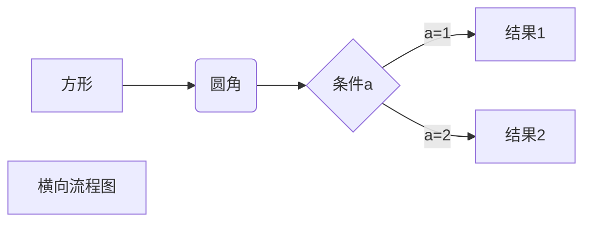

本章开始着手写博客，在**_posts**文件夹下新建名为`YY-MM-DD-title.md`的markdown文件，可以用任意编辑器打开，我用的是Typora。

结合markdown语法和Chirpy模板自身的[讲解](https://chirpy.cotes.page/posts/write-a-new-post/#table-of-contents)，能够快速写就相当美观的博客。下面列举一些常用组件和语法，其中加*表示在Chirpy中可用而markdown本身不支持。

## 头信息(Front Matter)*

头信息写在md文件的最前面，定义了全局变量，这使得Jekyll很酷。按照 YAML 的格式写在两行三虚线之间，如本文定义了标题、时间、文章类别、标签、不允许评论：

```yaml
---
title: Jekyll+模板，搭建个人博客（三）：撰写博客

date: 2023-05-22 17:00:00 +0800

categories: [web, jekyll] 

tags: [web, jekyll]

comments: false

# 其他还有：
description: . # 描述
author: # 作者信息
  name: Full Name
  link: https://example.com
toc: false # 关闭目录
math: true # 加载数学功能
mermaid: true # 启用Mermaid
pin: true # 置顶帖子

---
```

## 标题

```markdown
# h1
## h2
### h3
#### h4
```

- `# + 空格`即可，设置标题能够在网页右侧呈现导航栏，相当方便。

## 字体

```markdown
**粗体**
*斜体*
~~删除线~~
<u>下划线</u>
```

- 粗体快捷键为`Ctrl+B`和斜体为`Ctrl+I`，跟word一样。

## 列表

```markdown
# 有序列表
1. list1
2. list2
# 无序列表
- one
- two
# 任务列表
- [ ] task 1
- [x] task 2
# 描述列表\* Chirpy适用：
Sun
: the star around which the earth orbits
Moon
: the natural satellite of the earth, visible by reflected light from the sun
```

- 有序列表：`数字 + 空格`，无序列表：`- + 空格`。`tab`键缩进实现n级列表，`shift+tab`反之。

## 链接

```markdown
纯URL：<https://jinhanlei.github.io/>
文字上加超链接: [jinhanlei](https://jinhanlei.github.io/)
使用链接变量（如果同一个链接使用很多遍，可以使用一个变量来定义该链接，犹如论文）：
[jinhanlei][1]
[1]:https://jinhanlei.github.io/（这句话是看不见的）
```

- **效果**：
  
  纯URL: <https://jinhanlei.github.io/>

  文字上加超链接：[jinhanlei](https://jinhanlei.github.io/)

  链接变量：[jinhanlei][1]

  [1]:https://jinhanlei.github.io/
  
- 复制链接后在Typora中`Ctrl+K`，链接就自动粘上去啦，只需要输入文字即可。

## 图片

```markdown

在light模式下呈现阴影效果：
{: .shadow}
```

- **效果**：
  
  

  {: .shadow }
  
- 图片链接与普通链接区别仅在于最前面的`!`。

- 图片对于markdown是个棘手的问题。对于网络图片可以直接插入链接，但对于本地图片，采用图片的绝对/相对路径后，发布网页时这个路径就读取不到了。我目前采取的是在项目根目录建一个img文件夹，图片链接为/img/xx.jpg，但是这样无法在markdown中预览。未来考虑采用picgo+github的图床方式，欢迎补充！

## 代码

````markdown
# 代码块
```python
print("hello world")
```
# 内联代码，一般写在正文中
`hello，world!`
````

```python
print("hello world")
```

`hello，world!`

## 表格

```markdown
| Column1 | Column2 |
| ------- | ------- |
| Row1    | test    |
| Row2    | aaa     |
| Row3    | bb      |
| Row4    | cc      |
```

| Column1 | Column2 |
| ------- | ------- |
| Row1    | test    |
| Row2    | aaa     |
| Row3    | bb      |
| Row4    | cc      |

## 媒体资源

```markdown
<iframe width="420" height="315" src="//player.bilibili.com/player.html?aid=80433022&bvid=BV1GJ411x7h7&cid=137649199&page=1" frameborder="0" allowfullscreen></iframe>
```

<iframe height=270 width=480 src="//player.bilibili.com/player.html?aid=80433022&bvid=BV1GJ411x7h7&cid=137649199&page=1" scrolling="no" border="0" frameborder="no" framespacing="0" allowfullscreen="true"> </iframe>

- 视频、音频等处理思路是用html。例如b站，在视频底下有`分享-嵌入代码`，直接复制过来就好了，其他可以复制视频链接到src中也可。

## 引用(Quote)

```markdown
> 引用
```

> 引用
>
> > 内层引用
>
> 1. 第一
>2. 第二

- `>+空格`，`Tab`实现嵌套，这个和列表一样。

## 提示(Prompt)\*

```markdown
> Example line for prompt.
{: .prompt-info }
(可选prompt-tip、prompt-info、prompt-warning、prompt-danger)
```

> Example line for prompt.
{: .prompt-tip }

> Example line for prompt.
{: .prompt-info }

> Example line for prompt.
{: .prompt-warning }

> Example line for prompt.
{: .prompt-danger }

- 提示只在Chirpy下能正常显示，markdown下和引用是一样的。
- **注意**：`{: .prompt-info }`前是没有`>`的，但typora中会自动加上，需要点击typora左下角的`源代码模式`删去，就可以正常显示了。

## 脚注

```markdown
"never gonna give you up"——Rick[^Rick]
[^Rick]: Rick是一位著名歌手。
```

"never gonna give you up"——Rick[^Rick]

[^Rick]: Rick是一位著名歌手。

- 脚注会出现在文章最后，脚注各行之间需要添加空行，否则可能不会正常显示。

## 数学

```markdown
# 内联公式
$x+y$
# 公式块
$$
\begin{Bmatrix}
   a & b \\
   c & d
\end{Bmatrix}
$$

$$
\begin{CD}
   A @>a>> B \\
@VbVV @AAcA \\
   C @= D
\end{CD}
$$
```

$$
\begin{Bmatrix}
   a & b \\
   c & d
\end{Bmatrix}
$$

$$
\begin{CD}
   A @>a>> B \\
@VbVV @AAcA \\
   C @= D
\end{CD}
$$

- 确保在头信息中开启`math: true`，支持 [KaTeX](https://github.com/Khan/KaTeX) 或者 [MathJax](https://github.com/mathjax/MathJax) 来渲染数学表达式。

## Mermaid

~~~markdown
# 横向流程图

~~~


- 确保在头信息中开启mermaid: true`。Mermaid是一种图表生成工具，可以用来绘制流程图、时序图、甘特图等。更多详见[Mermaid文档](https://mermaid.js.org/intro/)。

## 其他

由于markdown支持HTML，因此HTML也可以在网页中直接呈现，比如：

```markdown
喜欢 <kbd>Ctrl</kbd> music～
```

喜欢 <kbd>Ctrl</kbd> music～

遇到无法正常显示的文本，需要转义，前面加反斜杠`\`。切记！不可以直接使用\<\>，必需加上反斜杠，不然push到GitHub会报错！

前往[jekyll文档](http://jekyllcn.com/docs/posts/)（中文），[jekyll doc](https://jekyllrb.com/docs/posts/)（英文原文档）了解更多。
