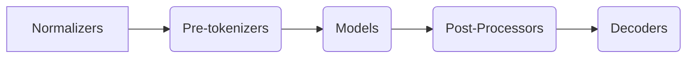

上一章我们了解了Transformers的pipeline。虽然pipeline很方便，但可能会感受到不自由。pipeline里面究竟干了啥？不清楚。想改输入的形式、想改模型结构，pipeline很难做到，这对我们的研究是非常不利的。Transformers不允许这么不自由！

Transformers提供了各种方法使得我们能够很方便、很清晰地构建一个文本模型。而在训练模型之前，需要tokenize文本。啥意思？

由于计算机并不认识字，只认识数字，所以需要将文本转换为数字再喂给计算机。在之前介绍Transformer原理时，我们建立了`{青:0, 花:1, 瓷:2}`的映射，但这样是很粗糙的，为什么不分成`{青花:0, 瓷:1}`这样？

于是Transformers设计了Tokenizer，主要做了这几件事：

1. 将文本分割成token；
2. 将tokens映射到对应的索引。

所以什么是token？不同模型的分词策略不尽相同，有的是字母，有的是字，有的是词，因此统一把切完后的文本叫做token。为了得到`tokens-索引映射`的词表，Huggingface提供了的[Tokenizers](https://huggingface.co/docs/tokenizers)包，来实现词表的构建。

## Tokenizer

在训练好的模型中加载词表，并将文本分割成token，只需寥寥几行代码。以`bert-base-chinese`为例，切割*annoyingly*：

```python
from transformers import BertTokenizer
tokenizer = BertTokenizer.from_pretrained("bert-base-chinese")
tokens = tokenizer.tokenize("annoyingly")
print(tokens)
```

得到：

$$
[ann, \#\#oy, \#\#ing, \#\#ly]
$$

*annoyingly*这个词被拆成了四个tokens。我们在各个vocab文件几乎都可以看到*##ly*、*##ing*这样以井号开头的词，根据上例，我们可以猜到这是把词切开的后面部分。那么，这样的tokens是怎么来的？

Tokenizer的处理流程如图所示：



我们通常把训练集叫做“语料库”（Corpus），根据语料库得到一个词表，词表需要涵盖语料库中的所有词。下面详解这一词表的构建流程。

### Normalizers

这里的Normalizers指规范文本，最常见的例子是小写转换和Unicode标准化，和我们在Transformers的原理讲解时提到的Norm并不是一回事。

小写转换很好理解，Unicode标准化是什么意思？试试如下代码：

```python
print("⾦"=="金")
```

什么？输出居然是`False`！这不是一样的吗？其实两者的形相同，但Unicode符不同，为了避免这种问题，需要将两个字变成同一个。[Unicode官方](https://www.unicode.org/reports/tr15/)提供了NFD、NFKD、NFC、NFKC四种标准化方法，选择一个使用即可。

### Pre-tokenizers

这一步进行分词。根据切分粒度的不同，天然可以把英文单词拆成：字符、词，但这样有很大的弊端。

#### 按字符切分（Character-based）

把文本切分为字符，这样就只会产生一个非常小的词表，比如英文就只有26个字母和标点等，很少会出现词表外的tokens。例如对*Attention is all we need!*按字符切分为：

$$
A|t|t|e|n|t|i|o|n|i|s|a|l|l|w|e|n|e|e|d|!
$$

但这样显然不太合理，因为字符本身并没有太多上下文的规律。更重要的是，这样仅仅一个单词就需要一堆向量去表示，遇到长文本时就爆炸了。

#### 按词切分（Word-based）

按词切分几乎是最直观的方法。

$$
Attention|is|all|we|need|!
$$

这种策略也同样存在问题。

对于中文，因为字之间没有空格天然分开成词，分词本身就是一项挑战。

对于英文，会将文本中所有出现过的独立片段都作为不同的token，从而产生巨大的词表，而实际上词表中很多词是相关的，例如 “dog” 和 “dogs”、“run” 和 “running”，如果视作不同的词，就无法表示出这种关联性。

并且，这样会出现OOV（Out of vocabulary）问题，在预测时有可能遇到语料库中从没出现过的词，分词器会使用一个专门的`[UNK]`token来表示，如果训练集不够大，词表里就那么几个词，那么用的时候，句子中会包含大量`[UNK]`，导致大量信息丧失。因此，一个好的分词策略，应该尽可能不出现`[UNK]`。

因此现在广泛采用的是一种同时结合了按词切分和按字符切分的方式——按子词切分 (Subword tokenization)。

#### 按子词切分（Subword-based）

BERT、GPT都采用这种做法，高频词直接保留，低频词被切分为子词。

Subword算是一种对字符和词折中的办法。不仅子词之间有规律可循、单词不会切的过分长，而且只用一个较小的词表就可以覆盖绝大部分的文本，基本不会产生`[UNK]`。

在统计词频前，需要预先切割词，切完才能去统计，Pre-tokenizers就是切割的作用。英文本身就可以根据空格分割，但是对于中日韩这样的连续字符，如果按单字切完，词表将会巨大，几乎需要130,000+个Unicode字符，更别说还要继续组词了！

于是，GPT-2等采用了ByteLevel的算法，将中日韩等字符映射到**256**个字符。具体可以参考[fairseq](https://github.com/facebookresearch/fairseq/blob/main/fairseq/data/encoders/byte_utils.py)和[icefall](https://github.com/k2-fsa/icefall/blob/master/icefall/byte_utils.py)。将[fairseq](https://github.com/facebookresearch/fairseq/blob/main/fairseq/data/encoders/byte_utils.py)里面的代码copy下来，加上：

```python
enc = byte_encode("唱、跳、rap、篮球")
print(enc)
print(byte_decode(enc))
print(len(BYTE_TO_BCHAR))
```

`唱、跳、rap、篮球`被编码为`åƔ±ãƀƁè·³ãƀƁrapãƀƁ篮çƐƃ`，这啥？我也看不懂，但是找到`rap`在里面了吗？英文是不变的，每个中文字符会被映射成三个`å`这种玩意儿，而这种玩意儿加上空格、英文字母和标点等，一共只有**256**个，他们的排列组合可以构成几乎所有字符。

之后去统计这些玩意儿的共现频率就可，但考虑到可能会有一些无效的组合，比如中间少个`Ɣ`，byte_decode就出不来了，于是引入基于动态规划的最佳解码方法smart_byte_decode：

```python
wrong_byte = "å±ãƀƁè·³ãƀƁrapãƀƁ篮çƐƃ"
print(byte_decode(wrong_byte))
print(smart_byte_decode(wrong_byte))
```

将每个汉字用[空格分隔](https://github.com/k2-fsa/icefall/blob/dca21c2a17b6e62f687e49398517cb57f62203b0/icefall/utils.py#L1370)，就可以按英文那般分词。做完分词，就可以来统计词频了，训练一个词表出来了。

### Tokenizer-Models

Tokenizer的Models是最核心的部分，指构建词表的统计模型，有三大算法：BPE、WordPiece和Unigram。

#### Byte Pair Encoding（BPE）

[BPE](https://arxiv.org/abs/1508.07909)简单有效，是目前最流行的方法之一，GPT-2和RoBERTa使用的Subword算法都是BPE。BPE的流程如下：

1. 根据分词结果统计词频，得到{"词 \</w\>": 词频}，词后加上末尾符是为了区分“**est**imate”和“high**est**”这类词；
2. 统计字符的个数（比如那**256**个玩意），得到{"字符": 字符频}表；
3. 拿字符频最高的字符与下一字符合并，统计合并后的Subword频；
4. 将Subword频添加到{"字符": 字符频}表，这时词表会扩大；
5. 继续拿表中频率最高的去合并，到末尾符时停止这个词的合并；
6. 重复直到预设的词表大小或最高频数为1。

更详尽的推导可以参考[这篇](https://zhuanlan.zhihu.com/p/424631681)。

#### WordPiece

[WordPiece](https://ieeexplore.ieee.org/document/6289079)主要在BERT类模型中使用。与BPE选择频数最高的相邻子词合并不同的是，WordPiece选择能够提升语言模型概率最大的相邻子词加入词表。

具体而言，WordPiece的做法是用合并后句子的概率值除以合并前的概率值。假设句子中的每个词独立存在，则整个长度为$l$的句子概率为：

$$
P(S)=p(w_0)p(w_1)p(w_2)p(w_3)...p(w_l)
$$

而合并前后的概率之差，直接不好减，套个$log$：

$$
P(S_后)-P(S_前)=logp(w_n)-logp(w_i)p(w_j)=log(\frac{p(w_n)}{p(w_i)p(w_j)})
$$

所以上面这个值越大就说明这两个子词越需要拼。我们通常看到带有`##`前缀的词表就是用的这种方法，`##`表示有子词在其之前。

#### Unigram

[Unigram](https://arxiv.org/pdf/1804.10959.pdf)的操作是和前两者反向的。不同于拼词，Unigram是割词，首先初始一个大词表，接着通过概率模型不断拆出子词，直到限定词汇量。

可以从WordPiece的公式去理解。由于刚开始都是长词，词表是巨大的，通过拆概率小的词，保留概率大的词，从而缩小词表。

根据这些方法，可以根据自己的语料，训练一个垂直领域的词表，这些方法能够很好地将高频词、术语等统计出来。

### Post-Processors

在训练词表后，还可能需要对句子进行后处理。例如一些模型当我们分完词，还想给句子加入特殊的标记，例如BERT会给句子加入分类向量和分隔符*”[CLS] My horse is amazing [SEP]”*，这时就需要Post-Processors。

下面我们从零开始来训练一个自己的词表。

## 从零开始训练一个BERT词表

本节我们从零开始训练一个BERT词表，采用BERT的WordPiece。

首先下载wiki数据，并解压到当前文件夹，这就是我们的语料库：

```shell
wget https://s3.amazonaws.com/research.metamind.io/wikitext/wikitext-103-raw-v1.zip
unzip wikitext-103-raw-v1.zip
```

数据为文本形式，每行或是空行，或是文本。

首先**Tokenizer-Models**定义采用WordPiece模型，不认识的词定义为`[UNK]`：

```python
from tokenizers import Tokenizer
from tokenizers.models import WordPiece
bert_tokenizer = Tokenizer(WordPiece(unk_token="[UNK]"))
```

**Normalizers**进行标准化、小写，并将音标转换成字母，如将`é`转换为`e`：

```python
from tokenizers import normalizers
from tokenizers.normalizers import NFD, Lowercase, StripAccents
bert_tokenizer.normalizer = normalizers.Sequence([NFD(), Lowercase(), StripAccents()])
```

**Pre-tokenizers**使用按空格分割（同时分割标点）：

```python
from tokenizers.pre_tokenizers import Whitespace
bert_tokenizer.pre_tokenizer = Whitespace()
```

**Post-Processors**处理成BERT的句子格式：

```python
from tokenizers.processors import TemplateProcessing
bert_tokenizer.post_processor = TemplateProcessing(
    single="[CLS] $A [SEP]",
    pair="[CLS] $A [SEP] $B:1 [SEP]:1",
    special_tokens=[
        ("[CLS]", 1),
        ("[SEP]", 2),
    ],
)
```

`:1`表示这是第二句的词。加载训练器开始训练：

```python
from tokenizers.trainers import WordPieceTrainer
trainer = WordPieceTrainer(vocab_size=30522, special_tokens=["[UNK]", "[CLS]", "[SEP]", "[PAD]", "[MASK]"])
files = [f"./wikitext-103-raw/wiki.{split}.raw" for split in ["test", "train", "valid"]]
bert_tokenizer.train(files, trainer)
bert_tokenizer.save("bert-wiki.json")
```

训练完成后，会形成`bert-wiki.json`文件，读取这个文件并输入两个句子：

```python
from tokenizers import Tokenizer
tokenizer = Tokenizer.from_file("./bert-wiki.json")
output = tokenizer.encode("Hello, y'all! How are you 😁 ?", "I am annoyingly")
print(output.tokens)
```

可以发现已经按照**Post-Processors**的格式处理了。

另外，还有一个实用的功能是往词表中增加自定义的词。例如上例中有`[UNK]`，把它添加到词表里：

```python
from tokenizers import Tokenizer
tokenizer = Tokenizer.from_file("./bert-wiki.json")
tokenizer.add_tokens(["😁"])
output = tokenizer.encode("Hello, y'all! How are you 😁 ?")
print(output.tokens)
```

## 小结

本章我们根据自己的语料，得到了一个专业的词表。根据词表，就能够得到分词结果。下一章我们继续学习用PyTorch进行数据处理。
