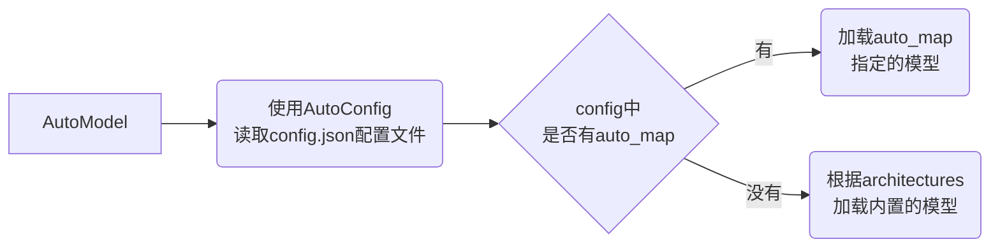

本章介绍Transformers和PyTorch修改模型的方法。Transformers包提供了`Model`类为我们快速加载一个预训练模型，但是对于其他模型组件如神经网络层、激活函数、优化算法、损失函数等，仍需用到PyTorch进行加载。比如*[BERT](https://arxiv.org/abs/1810.04805)*本身不支持文本分类，这时就要用PyTorch加一分类层。下面介绍修改和训练模型中会用到的方法。

## Model

在本系列（一）介绍的`pipeline`中，我们用`model`参数定义使用的模型。而更多时候，我们使用Transformers的各种`Model`类来加载模型，例如*BERT*：

```python
from transformers import BertModel

model = BertModel.from_pretrained("bert-base-cased")
```

或者使用`AutoModel`：

```python
from transformers import AutoModel

model = AutoModel.from_pretrained("bert-base-cased")
```

多数模型都有内置的`Model`类，如`BertModel`、`RobertaModel`、`GPT2Model`等等。但如果我发明了一个新模型，就不能用`Model`类加载了吗？答案是可以的。

### AutoModel类

`AutoModel`允许我们在换模型时，只需修改参数而不用修改其他代码（例如把BERT换成RoBERTa），并且`AutoModel`可以加载自定义的模型，例如加载大语言模型[ChatGLM-6b](https://huggingface.co/THUDM/chatglm-6b)（模型很大，谨慎加载）：

```python
from transformers import AutoModel

model = AutoModel.from_pretrained("THUDM/chatglm-6b", trust_remote_code=True)
```

奇怪的是，在Transformers中，*ChatGLM*并不像*BERT*，它没有内置的`ChatGLMModel`类，那`AutoModel`是怎么认识他的？是怎么解析他的结构的？`AutoModel`的逻辑在于：



ChatGLM的config.json中，有：

```json
  "auto_map": {
    "AutoConfig": "configuration_chatglm.ChatGLMConfig",
    "AutoModel": "modeling_chatglm.ChatGLMForConditionalGeneration",
    "AutoModelForSeq2SeqLM": "modeling_chatglm.ChatGLMForConditionalGeneration"
  }
```

于是，在运行AutoModel时，找到配置文件中的`auto_map`，指定用`modeling_chatglm.py`文件中的`ChatGLMForConditionalGeneration`类作为其模型。

如果既没`auto_map`，也不在内置模型中，就会报错。

在PyCharm中按住<kbd>ctrl</kbd>键，点击`AutoModel`和`from_pretrained`，就能看到相应加载配置文件和加载自定义模型的代码。

### 加载和储存模型

通过调用 `.from_pretrained()` 函数可以自动加载模型权重，默认保存到 `~/.cache/huggingface/transformers` ，可以指定`cache_dir='./'`使之保存到当前目录。所有存储在[Model Hub](https://huggingface.co/models)上的模型都能加载。

当然，可以先将模型下载下来，只需指定本地路径即可：

```python
from transformers import BertModel

model = BertModel.from_pretrained("./models/bert/")
```

保存模型与加载模型类似，就是把`from`改成`save`。例如保存加载的 BERT 模型：

```python
from transformers import AutoModel

model = AutoModel.from_pretrained("bert-base-cased")
model.save_pretrained("./models/bert-base-cased/")
```

中间一般会有训练模型的步骤，这在未来章节会详细介绍。`save_pretrained`会在路径下保存两个文件：

- config.json
- pytorch_model.bin

vocab文件去哪了？喔，原来是由本系列的（二）介绍的Tokenizer生成了。

除此之外，Transformers也针对各类任务，设计了不同的结构，有着统一的加载方式`AutoModelFor...`，这使得各类模型能够适配不同任务。

### AutoModelFor...

要指定模型用于某类任务，常用`AutoModelFor...`。例如将*BERT*用到文本分类任务，有`AutoModelForSequenceClassification`：

```python
from transformers import AutoModelForSequenceClassification

model = AutoModelForSequenceClassification.from_pretrained("bert-base-cased")
```

这里会有一个warning：

> Some weights of BertForSequenceClassification were not initialized from the model checkpoint at bert-base-cased and are newly initialized: ['classifier.bias', 'classifier.weight']
You should probably TRAIN this model on a down-stream task to be able to use it for predictions and inference.
{: .prompt-warning }

这是因为BERT本身没有做下游文本分类任务，这个被`AutoModelFor`加上的分类层是初始化、没被训练的，需要针对自己的数据去训练才行。其他还有：

- 预训练：AutoModelForPreTraining；
- 因果语言模型：AutoModelForCausalLM。*GPT*就是这类，和文本生成的区别在于他只有*Decoder*；
- 掩码预测：AutoModelForMaskedLM。*BERT*就是这类，预测被*MASK*的词；
- Seq2Seq：AutoModelForSeq2SeqLM；
- 问答：AutoModelForQuestionAnswering；
- 序列标注：AutoModelForTokenClassification。

等等，详见[官方文档](https://huggingface.co/docs/transformers/model_doc/auto)。值得注意的是，任务必须是模型可以做的，假如让*BERT*做图片分类，就会报错：

```python
from transformers import AutoModelForImageClassification

model = AutoModelForImageClassification.from_pretrained("bert-base-cased")
```

聪明的你可能会问，加载模型时有`BertModel`和`AutoModel`相对应，那这里针对任务时有没有`BertForSequenceClassification`？答案是有的。`BertForSequenceClassification`的源代码中可以看到Transformers官方是如何将*BERT*改造成句子分类模型的，印入眼帘的除了`BertModel`，还有PyTorch的各个组件。

## PyTorch组件

本节介绍在训练模型时会用到的PyTorch组件，包括神经网络组件`torch.nn`和优化组件`torch.optim`。

### torch.nn

`torch.nn`包里面的大部分类都是继承了父类`torch.nn.Module`，在我们自己写一个基于PyTorch的模型时，也会这样继承，因为`Module`定义了写模型的格式，并提供了很多实用的方法。

继承了`Module`的模型都是先实例化，再使用。例如：

```python
import torch
import torch.nn as nn

inputs = torch.rand(4, 6, 10)
fc = nn.Linear(10, 5)
out = fc(inputs)
print(out.shape)
```

你也许会有和我一样的疑惑，为什么实例化之后，不是`实例.方法()`，而是直接`实例()`？这是因为继承`Module`的类都必需重写`forward`方法，而这个方法是*callable*的，这是*Python*的特性，对于*callable*的对象，可以当作方法来使用。常见的`int()、str()、bool()`事实上都是类，但是使用起来就如同方法。

**`nn.Linear`**是最最常用的，输入$x$，进行$y = xA^T + b$运算。上例中，

1. 首先声明线性层的维度是$10 \times 5$；
2. 再处理输入，把$10$维输入变换到$5$维。

另一个常用的是**`nn.Dropout`**，能够随机将矩阵中的一些元素置0。

```python
inputs = torch.rand(5, 10)
drop = nn.Dropout()
out = drop(inputs)
print(out)
```

`torch.nn`包有大量内置的**激活函数**，如*ReLU、GELU、Tanh、Softmax*等等，就不用我们自己去写了。看个例子：

```python
inputs = torch.tensor([-1, 2, -3, 4])
relu = nn.ReLU()
out = relu(inputs)
print(out)
```

*ReLU*把所有负数变成了0。

另外，`torch.nn`内置了**损失函数**，如*MSELoss、NLLLoss、CrossEntropyLoss*；**标准化方法**，如*BatchNorm、LayerNorm*等；**内置模型**，如*RNN、LSTM、GRU、Transformer*等。更多详见[torch.nn官方文档](https://pytorch.org/docs/stable/nn.html)。

### torch.optim

为了弥补朴素梯度下降的缺陷，出现了各种优化算法，而许多经典的优化算法都在`torch.optim`中有实现，常用的有*SGD、Adam、AdamW*。

以*SGD*为例，先手推用PyTorch来实现线性函数对$sin(x)$函数的拟合。

损失定义为*MSE*，即：

$$
loss = \frac{1}{n}\sum(\hat{y} -y)^2
$$

其中$\hat{y}=WX$，于是忽略常数损失对$X$的导数为：

$$
gradient=(w*x-y)*x
$$

每次梯度的更新就是：

$$
W^{'}=W - lr*gradient
$$

设置超参数学习率$lr=10^{-5}$，梯度更新$10000$次。

```python
import torch
from tqdm.auto import tqdm

def sgd(x, y, lr=1e-5, epochs=10000):
    w = torch.rand(x.shape)
    progress_bar = tqdm(range(epochs))
    for epoch in range(epochs):
        w -= lr * (w * x - y) * x
        loss = torch.sum(w * x - y) ** 2 / x.shape[1]
        progress_bar.set_description(f"Epoch {epoch} loss: {loss:>7f}")
        progress_bar.update(1)
    return w

x = torch.arange(20).view(2, -1)
y = torch.sin(x)
w = sgd(x, y)
print("\n", y - w * x)
```

可以看到$loss$不断减小，最后结果部分是$0$或者接近$0$​，意味着拟合效果还可以。继续上例，试试$lr=20$，发现问题了吗？损失居然为$nan$了，这是**梯度爆炸**问题。因为$W$相对小，而学习率过大导致梯度很大，一直减一个超大的梯度，更新后的$W$就累积到无穷了，损失也就无穷了。

上例是单纯的线性函数拟合三角函数，而神经网络用*全连接+激活函数*实现了更强大的拟合能力。而用神经网络拟合$sin(x)$函数，如下代码：

```python
import torch
import torch.nn as nn
from tqdm.auto import tqdm

class ANN(nn.Module):
    def __init__(self, input_dim, output_dim):
        super(ANN, self).__init__()
        self.sigmoid = nn.Sigmoid()
        self.fc = nn.Linear(input_dim, output_dim)

    def forward(self, x):
        output = self.fc(x)
        output = self.sigmoid(output)
        return output

epochs = 10000
lr = 20
device = torch.device("cuda:0" if torch.cuda.is_available() else "cpu")

x = torch.rand(20).view(2, -1).to(device)
y = torch.sin(x).to(device)
model = ANN(x.shape[1], y.shape[1])
model = model.to(device)
optimizer = torch.optim.SGD(model.parameters(), lr=lr)
lossfc = nn.MSELoss()
progress_bar = tqdm(range(epochs))
for epoch in range(epochs):
    optimizer.zero_grad()
    outputs = model(x)
    loss = lossfc(outputs, y)
    loss.backward()
    optimizer.step()
    progress_bar.set_description(f"Epoch {epoch} loss: {loss:>7f} lr: {optimizer.param_groups[0]['lr']}")
    progress_bar.update(1)

print("\n", model(x)-y)
```

可以看到$0$更多了，说明这个神经网络拟合得更好。将代码中的`optimizer`替换成*Adam、AdamW*等同理也可使用。

原则上来说，梯度会越来越小，所以理想状态是学习率也跟着一起越来越小，`torch.optim`中也提供了**动态调整学习率**的方法：

```python
# 在optimizer下面定义scheduler
scheduler = torch.optim.lr_scheduler.StepLR(optimizer, step_size=1000, gamma=0.1)
# 并在optimizer.step()后面更新
scheduler.step()
```

`StepLR`是线性的，可以看到学习率每个`step_size`在`gamma`倍减小。但是学习率单调减小也不太对，最开始最大的话，可能会导致权重的震荡。所以学习率应该先增大、后减小，增大的过程叫做`warmup`。

PyTorch没有提供`warmup`的方法，而Transformers中提供了`get_scheduler`，如下例在`warmup`$300$步后开始衰减：

```python
from transformers import get_scheduler
lr_scheduler = get_scheduler(
        'linear',
        optimizer,
        num_warmup_steps=300,
        num_training_steps=epochs * len(x)
    )
```

## Transformers和PyTorch结合

```python
from transformers import BertForSequenceClassification
```

按住<kbd>ctrl</kbd>点击`BertForSequenceClassification`，可以看到*BERT*分类就是给原生*BERT*加了一层分类层。仿照其写法，我们可以自己把分类器写出来：

```python
from torch import nn
from transformers import BertPreTrainedModel, BertModel, RobertaPreTrainedModel, RobertaModel

class BertForCLS(BertPreTrainedModel):
    def __init__(self, config, args):
        super().__init__(config)
        self.bert = BertModel(config, add_pooling_layer=False)
        self.dropout = nn.Dropout(config.hidden_dropout_prob)
        self.classifier = nn.Linear(config.hidden_size, args.num_labels)
        self.post_init()

    def forward(self, batch_inputs, labels=None):
        outputs = self.bert(**batch_inputs)
        cls_vectors = outputs.last_hidden_state[:, 0, :]
        cls_vectors = self.dropout(cls_vectors)
        logits = self.classifier(cls_vectors)
        loss = None
        if labels is not None:
            loss_fct = nn.CrossEntropyLoss()
            loss = loss_fct(logits, labels)
        return loss, logits
```

很多模型都可以通过看Transformers源码的方式，改写成自己想要的，并在此基础上进行更多的魔改。

## 小结

本章我们学习了如何用Transformers加载模型，并介绍了PyTorch中的一些必要组件，最后结合Transformers和PyTorch，较为详细地修改了模型的内部结构。

下一章我们将跑通Finetune一个BERT模型的全流程。
