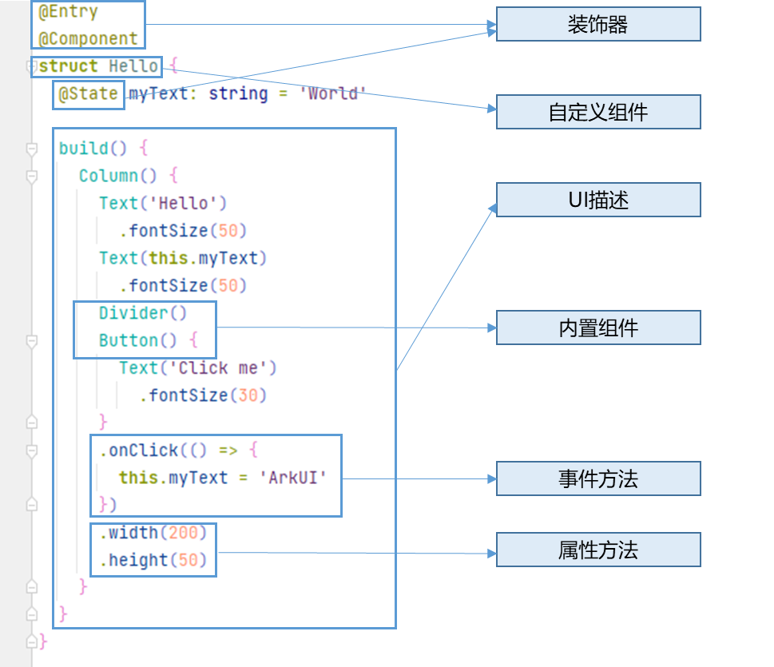

## ArkTS 声明式开发范式
- 装饰器

    用来装饰类、结构体、方法以及变量，赋予其特殊的含义，如上述示例中 `@Entry` 、 `@Component` 、 `@State` 都是装饰器。具体而言， `@Component` 表示这是个自定义组件； @Entry 则表示这是个入口组件； `@State` 表示组件中的状态变量，此状态变化会引起 UI 变更。

- 自定义组件

    可复用的 `UI` 单元，可组合其它组件，如上述被 `@Component` 装饰的 `struct Hello`。

- UI 描述

    声明式的方式来描述 UI 的结构，如上述 `build()` 方法内部的代码块。

- 内置组件

    框架中默认内置的基础和布局组件，可直接被开发者调用，比如示例中的 `Column`、`Text`、`Divider`、`Button`。

- 事件方法

    用于添加组件对事件的响应逻辑，统一通过事件方法进行设置，如跟随在` Button` 后面的 `onClick()`。

- 属性方法

    用于组件属性的配置，统一通过属性方法进行设置，如`fontSize()`、`width()`、`height()`、`color()` 等，可通过链式调用的方式设置多项属性。

